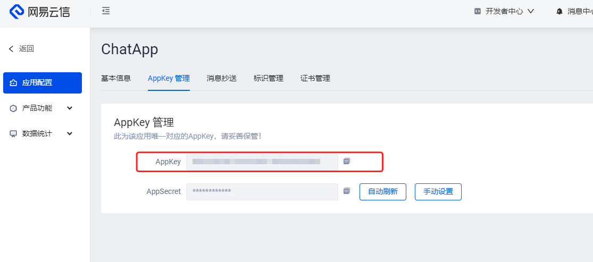
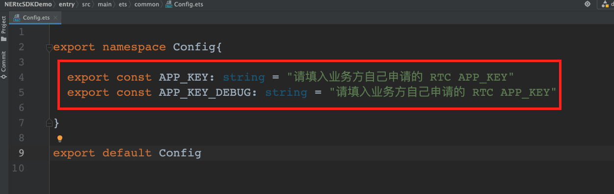
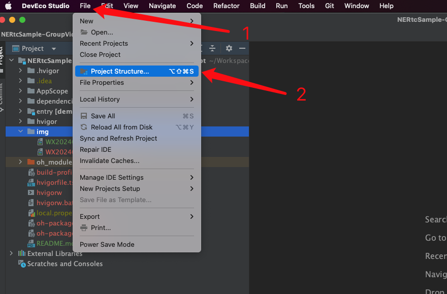
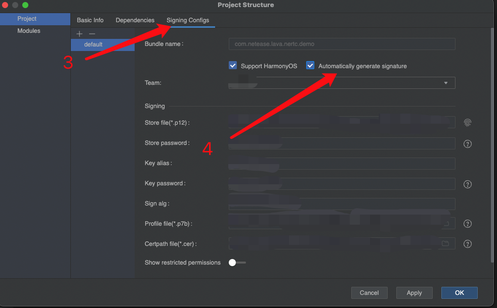
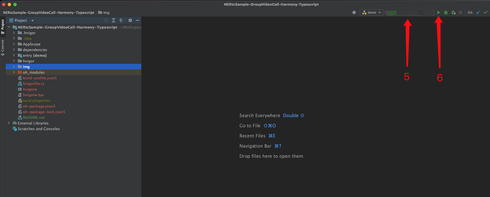
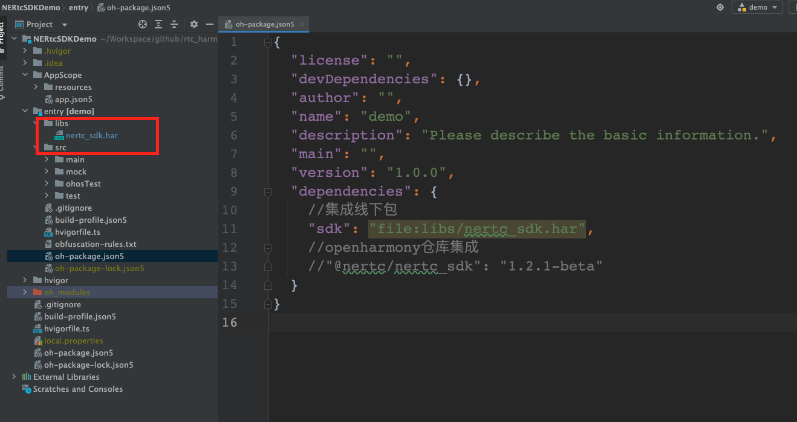

# 快速入门

## 环境要求

### 编译环境
- DevEco Studio NEXT Developer Beta1（5.0.3.403） 及以上。
- HarmonyOS SDK API 11 及以上。
- 运行环境 HarnomyOS NEXT 2.1.2.5 (Canary1) 以上

>- 由于鸿蒙Beta版本更新迭代速度较快，且对下兼容做的不是很好，运行或者编译出错，烦请查看 NERtcSDK 版本和 DevEco Studio 版本以及手机版本是否匹配。
>- 历史NERtcSDK版本和鸿蒙版本之间匹配关系见文档：[CHANGELOG.md](./document/CHANGELOG.md) 

### 设备要求
- 真机华为 Mate 系列
- 操作系统 HarnomyOS NEXT 2.1.2.5 (Canary1) 以上


### 操作步骤

#### 步骤1: 创建应用
创建应用并获取 AppKey，详情见链接：[点这里](https://doc.yunxin.163.com/console/docs/TIzMDE4NTA?platform=console)

#### 步骤2: 配置AppKey

在应用配置中获取到AppKey配置到DEMO中。






#### 步骤3: 编译运行

- **打开 RTC DEMO 配置签名：**





- **连接真机，编译运行:**




<br>

## DEMO 使用教程

如果您想了解 DEMO 详细的使用操作请移步 [DEMO使用教程](./document/DEMOUSEAGE.md)


## SDK 接入流程

### 线下集成

- 拷贝 nertc_sdk.har 到项目文件夹中，例如： entry/src/main/libs



- NERtcSDK DEMO 工程下 oh-package.json5 配置 nertc_sdk.har
```json5
  "dependencies": {
    //集成线下包
    "sdk": "file:libs/nertc_sdk.har",
  }
```
- 安装第三方包，点击 Run 'ohpm install'

### 依赖Openharmony仓库集成

```json5
  "dependencies": {
    //openharmony仓库集成
    "@nertc/nertc_sdk": "1.2.1-beta"
  }
```

<br>

# 其他

如果您在使用过程中，有任何疑问都可以直接在本工程上提交 issue，或者在云信官网进行咨询。


