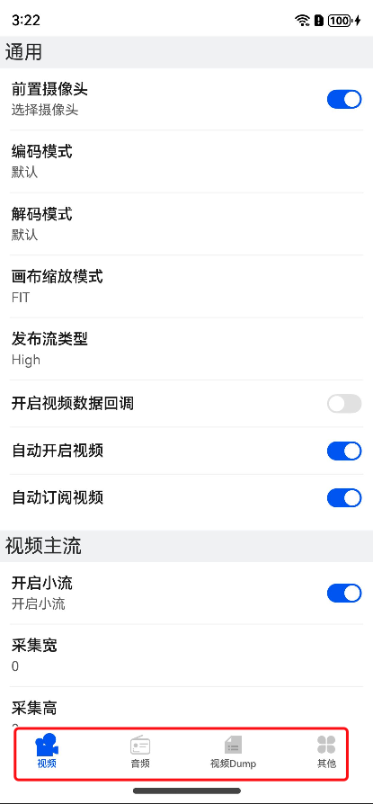

# DEMO 使用教程

## 首页

- 最右角按钮点击可进入设置页面
- 下面填入频道名和用户名，点击入会按钮可进入RTC房间
- 点击预览可进入预览界面
- 最底部红框是会前操作
    - 权限检测: 点击会检查是否缺失SDK所需权限
    - 会前测速: 检测当前网络质量
    - 清除缓存: 任何在设置页面设置的参数都会被清空
    - 模拟崩溃: 忽略  
 

 

## 设置界面

可通过点击底部的四个按钮或者左右滑动来切换 **tab** 页，设置的参数会在入会或在会中体现，调用 NERtcSDK 接口的参数都是从此处获取，不设置也会有默认值。

- 视频: 包括 camera相关设置、编码设置、屏幕共享等。
- 音频: 包括 音频编码参数、伴音、音效、外部输入等。
- 视频dump: 主要用于出现视频画面异常的排查手段，由于dump的yuv数据非常，必要时请在云信技术支持指导下使用。
- 其他: 网络测速、服务器录制等。

 
 

> 注意：从屏幕最左侧向右划出，即可退出设置页面
>
>从设备路径 data-app-el2-100-base-com.netease.lava.nertc.demo-haps-demo-prefernces-netease_settings 文件中可查看用户设置的参数是否符合预期。

 

## 会内页面

点击频道号可选择打开不同模块功能接口的设置页面，如下图所示：

 

比如点击了视频，可展示视频相关的接口设置：

 

### 会中改变参数

可能入会后，想使用外部视频输入的功能，但是会前没有设置。可点击频道名弹出浮框，选择其他。

